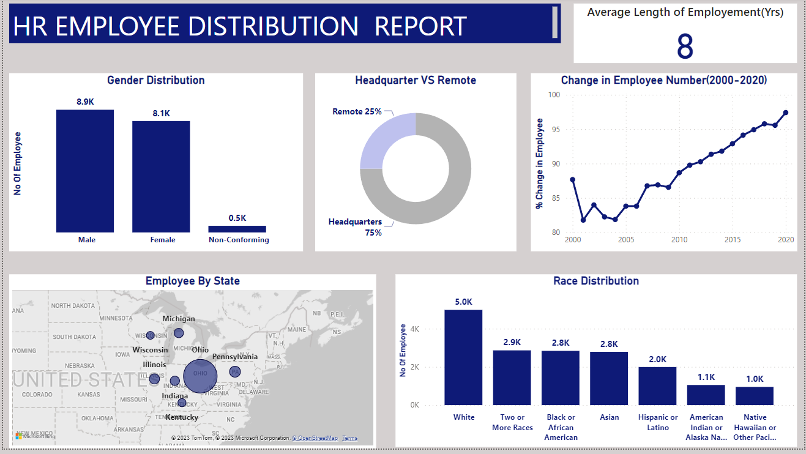

# HR-Analytics-Project
This project utilizes Power BI and MySQL.  started by processing data in MySQL, conducting data cleaning and analysis. The refined data was then imported into Power BI. The resulting dashboard offers insights into various distributions, such as race, gender, location, age groups, and departments. It also provides valuable insights into hiring and termination trends, contributing to informed business growth.

## 📌Key Steps
1. **Data Collection and Cleaning:**  - Clean data using MySQL.
2. **Critical Question Analysis:** -  Utilize SQL for in-depth analysis.
3. **PowerBI Dashboard Creation:** -  Build an interactive dashboard using various charts like cards, line charts, stacked column charts, maps, and tables.

## 📌Key-Insight
1. A majority, around 75%, operate from the headquarters  rather than remotely.
2. A significant 83% of the workforce falls within the age group of 25-54 years.
3. The average tenure for terminated employees is around 7 years.
4. The gender distribution across departments is fairly balanced but there are generally more male than female employees.
5. The Marketing department has the highest turnover rate followed by Training. The least turn over rate are in the Research and development, Support and Legal departments.
6. The average tenure for each department is about 8 years with Legal and Auditing having the highest and Services, Sales and Marketing having the lowest.
7. A consistent increase in the percentage of employees since the company's inception.
8. White employees are most prevalent, while Native Hawaiian and American Indian employees are the least.
9. Ohio accounts for a significant portion of the employee base.
                                                                                         

